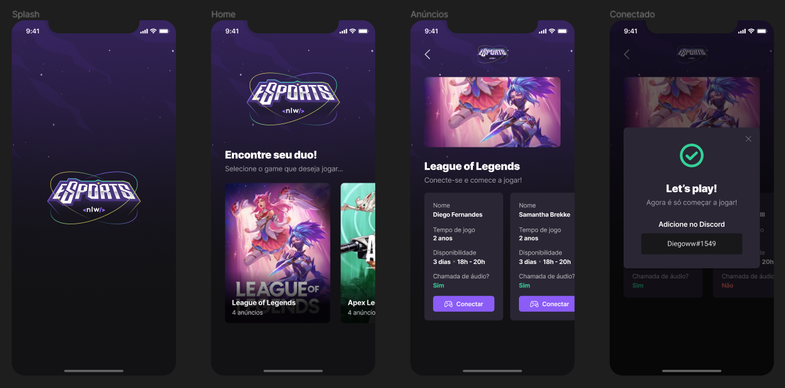

# eSports Mobile

App where gamers can find a partner to play their favorite games together.

Project created during a [Rocketseat](https://www.rocketseat.com.br/) event called NLW eSports. NLW is a week-long intensive coding program focused on developing projects to boost coding skills.

## Table of contents

- [The project](#the-project)
- [Preview](#preview)
- [Built with](#built-with)
- [Project setup](#project-setup)

## The project

Integration with [eSports Server](https://github.com/leandrodalmolin/esports-server) to list games, ads and publish gamers ads so they can find people to play together.

Users should be able to:

- See list of games with ads counter
- Publish ad to a specific game
- View game's ads

## Preview



## Built with

- [Expo](https://expo.dev/) - Platform for making universal native apps
- [React Native](https://reactnative.dev/) - Framework to build mobile apps with React
- [TypeScript](https://www.typescriptlang.org/) - JavaScript with syntax for types

## Project setup
```
npm install
```

### Start dev server
```
npm run dev
```